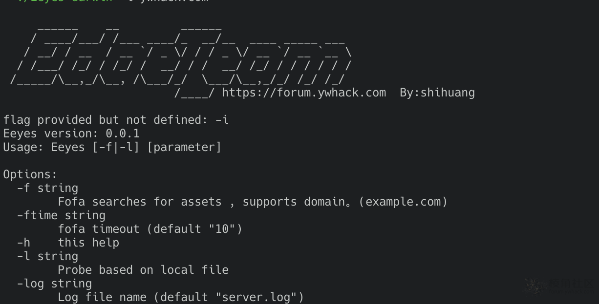
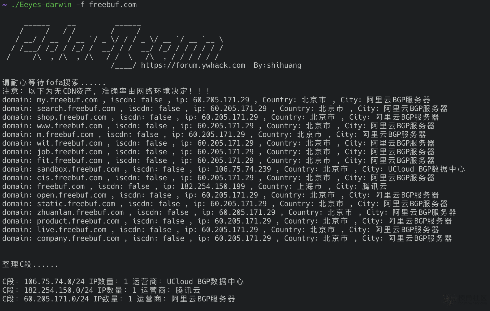

# Eeyes(棱眼)-快速筛选真实IP并整理为C段

Eeyes(棱眼)是之前写的工具，旨在获取到大量域名之后，获取其中真实IP并整理成c段，有助于在src中或红蓝攻防中快速定位目标的真实资产，可结合棱洞使用，识别cdn的准确率是网络环境决定的。

```bash
     ______    __         ______
    / ____/___/ /___ ____/_  __/__  ____ _____ ___
   / __/ / __  / __ `/ _ \/ / / _ \/ __ `/ __ `__ \
  / /___/ /_/ / /_/ /  __/ / /  __/ /_/ / / / / / /
 /_____/\__,_/\__, /\___/_/  \___/\__,_/_/ /_/ /_/
			 /____/ https://forum.ywhack.com  By:shihuang

Eeyes version: 0.0.1
Usage: Eeyes [-f|-l] [parameter]

Options:
  -f string
    	Fofa searches for assets , supports domain。(example.com)
  -ftime string
    	fofa timeout (default "10")
  -h	this help
  -l string
    	Probe based on local file
  -log string
    	Log file name (default "server.log")
```




